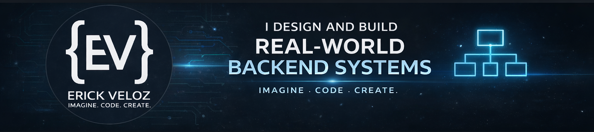

<!-- Banner -->

# Hi 👋 I'm Erick Veloz

### I design and build real-world backend systems

---

## 🧠 Philosophy

Programming is not about writing code fast.  
It's about designing logic, structuring solutions, and building systems that solve real problems.

I'm not learning to code quickly.  
I'm learning to think.

---

## 🐍 Activity

  

---

## 🚀 About Me

- Backend-focused developer working with **Python and databases**
- Building **real systems**, not just practice projects
- Focused on **clean architecture and structured development**
- Interested in how systems work internally and how to design them properly
- Developing technology as part of a growing IT services initiative

---

## 🧱 Core Stack

---

## 🧰 Additional Experience

---

## 📊 GitHub Stats

---

## 📊 Most Used Languages

---

## 🧠 Currently Working On

- Advanced Python (functions, modular design, architecture)
- Backend development with Flask
- SQL integration with real systems
- Clean Code principles
- Building scalable backend systems

---

## 🔭 Vision

Building backend systems, automation tools, and structured software solutions that integrate logic, clarity, and real-world impact.

Coding is structure.  
Discipline.  
Vision turned into reality.

---

## 📫 Contact

