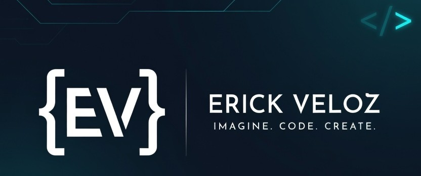

<!-- Banner -->

# Hi 👋 I'm Erick Veloz

### Imagine. Code. Create.

---

## 🧠 Philosophy

Programming is not just writing code.  
It's about logical design, structuring solutions, and building systems that solve real-world problems.

I'm not just learning to code.  
I'm learning to think.

---

## 🚀 About Me

- Backend-focused developer working with **Python and databases**
- Building systems, not just practice projects
- Focused on **clean structure and well-organized development**
- Interested in understanding how systems work internally and how to design them properly
- Developing technology as part of a growing **IT services initiative**

---

## 🧱 Core Stack

---

## 🧰 Additional Experience

---

## 📊 GitHub Stats

---

## 📊 Most Used Languages

---

## 🧠 Currently Working On

- Advanced Python (functions, modular design, architecture)
- Backend development with Flask and Django
- SQL integration 
- Clean Code principles
- Building scalable backend systems

---

## 🔭 Vision

Building backend systems, automation tools, and structured software solutions that integrate logic, clarity, and real-world impact.

Imagine. Code. Create.

---

## 📫 Contact

